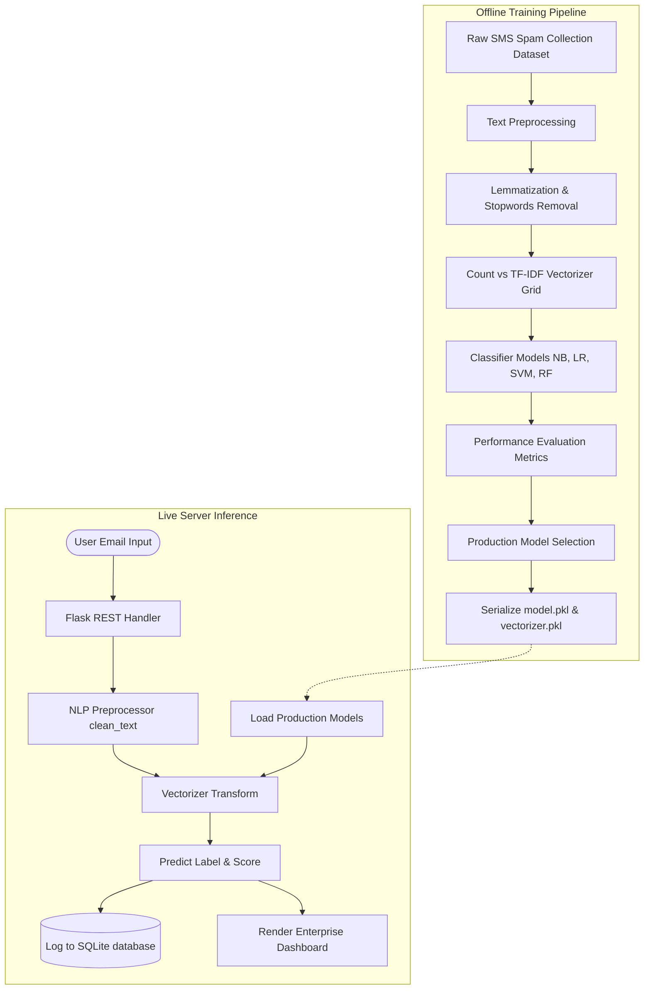
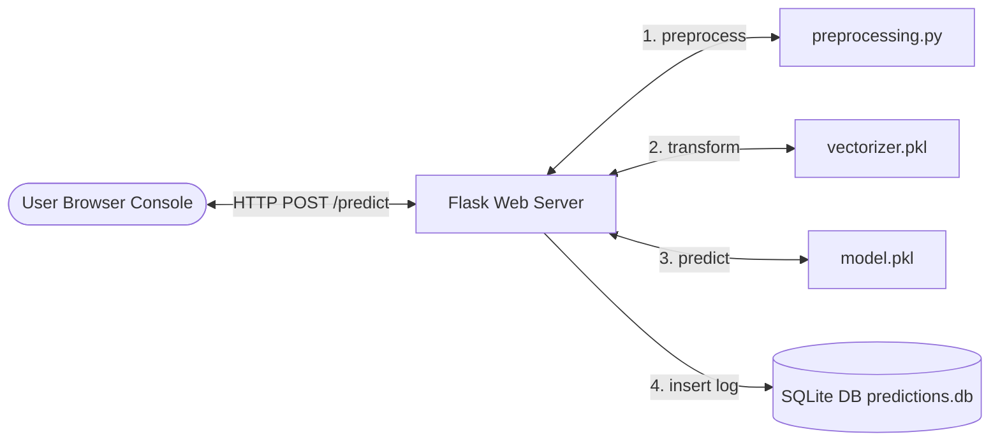
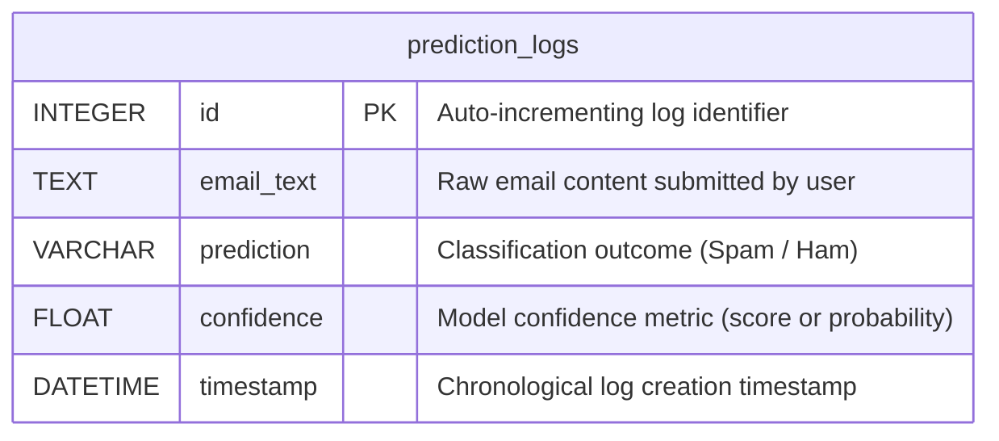

# Project Report: AI-Powered Spam Email Detection System

## 1. Abstract
Electronic mail (Email) remains a primary communication channel for corporate, personal, and academic exchange. However, the rise of automated marketing, phishing scams, and malicious spam campaigns poses severe threats to productivity, storage capacity, and user security. This project presents a complete, end-to-end **AI-Powered Spam Email Detection System**. 

The system leverages Natural Language Processing (NLP) to clean and normalize raw email text and trains multiple machine learning classifiers—Naive Bayes, Logistic Regression, Linear Support Vector Machine (SVM), and Random Forests—across two feature extraction techniques (Count Vectorization and TF-IDF Vectorization). The best-performing model combination is serialized and served via a high-performance Flask enterprise console featuring live threat audits logged to a local SQLite database.

---

## 2. Problem Definition
Spam filtering is a binary classification problem. Let a set of email documents $D = \{d_1, d_2, \dots, d_n\}$ be represented by feature vectors, and let $Y = \{0, 1\}$ be the set of class labels where:
- $0$ represents **Ham** (Legitimate, clean communications).
- $1$ represents **Spam** (Unsolicited, advertisement, or phishing threats).

The goal is to learn a mapping function $f: D \to Y$ that maximizes classification accuracy while minimizing **False Positives** (flagging critical legitimate emails as spam).

---

## 3. NLP Preprocessing Pipeline
Raw email content contains formatting noise, HTML links, telephone numbers, and inflected word forms that bloat the feature space. The system implements a modular preprocessing pipeline using `NLTK`:

1. **Lowercasing**: Standardizes text to lowercase to ensure consistency (e.g., "FREE" vs "free").
2. **Entity Normalization**: Uses regular expressions to map dynamic tokens to static category tags, preventing vocabulary sparsity:
   - URLs ($https?://\dots$) $\to$ `url`
   - Email Addresses $\to$ `email`
   - Numbers ($1000, 99.5$) $\to$ `number`
3. **Punctuation Stripping**: Retains only alphanumeric tokens and whitespace characters.
4. **Tokenization**: Splits sentences into individual words.
5. **Stopwords Filtering**: Removes common English words (e.g., "the", "is", "at") that do not carry semantic classification weight.
6. **WordNet Lemmatization**: Resolves words to their base dictionary forms (e.g., "running", "runs" $\to$ "run") to consolidate semantic meaning.

---

## 4. Feature Extraction Comparison
To feed text into classifiers, it must be converted to numerical vectors:
- **Count Vectorizer**: Represents documents as bags of words, counting word frequencies ($TF_{i,j}$). It captures the presence and raw counts of features but can be biased toward high-frequency words.
- **TF-IDF Vectorizer (Term Frequency-Inverse Document Frequency)**: Scales term frequency by the logarithmic inverse of the term's document frequency:
  $$\text{TF-IDF}(t, d, D) = \text{TF}(t, d) \times \log\left(\frac{|D|}{1 + |\{d \in D : t \in d\}|}\right)$$
  This dampens the weight of terms that appear ubiquitously across the entire corpus, emphasizing distinctive keywords.

---

## 5. Machine Learning Models
We compare four distinct classification algorithms:
1. **Multinomial Naive Bayes (NB)**: A probabilistic classifier based on Bayes' Theorem under the assumption of feature independence. Extremely fast and highly effective for high-dimensional text data.
2. **Logistic Regression (LR)**: Models class probabilities using the logistic sigmoid function, providing robust log-loss optimization for linear boundaries.
3. **Support Vector Machine (SVM / LinearSVC)**: Finds the optimal hyperplane that maximizes the geometric margin between classes in high-dimensional space.
4. **Random Forest (RF)**: An ensemble classifier compiling a forest of decision trees trained on random feature subsets, providing strong non-linear boundaries.

---

## 6. System Flowchart & Architecture

### 6.1 Data Processing Flowchart
The flowchart below illustrates the dual-path training and live inference pipelines:

### 6.2 System Architecture Diagram
The physical deployment layout shows data streams between the frontend browser client, Flask middleware, scikit-learn models, and SQLite data logs:

---

## 7. Database Entity Relationship (ER) Diagram
To enable log audits and session analysis, predictions are recorded in an SQLite database. Below is the Entity Relationship diagram showing the structural layout of the `prediction_logs` table:

---

## 8. Model Comparison Matrix
*(This table is populated during grid execution in `train.py`)*

| Feature Vectorizer | Classifier Algorithm | Test Accuracy | Test Precision | Test Recall | Test F1-Score |
| :--- | :--- | :---: | :---: | :---: | :---: |
| Count Vectorizer | Naive Bayes | 98.83% | 97.22% | 93.96% | 95.56% |
| TF-IDF Vectorizer | Naive Bayes | 97.58% | 100.00% | 81.88% | 90.04% |
| Count Vectorizer | Logistic Regression | 98.39% | 97.12% | 90.60% | 93.75% |
| TF-IDF Vectorizer | Logistic Regression | 97.22% | 96.09% | 82.55% | 88.81% |
| Count Vectorizer | Support Vector Machine | 98.74% | 97.87% | 92.62% | 95.17% |
| TF-IDF Vectorizer | Support Vector Machine | 98.83% | 97.22% | 93.96% | 95.56% |
| Count Vectorizer | Random Forest | 98.65% | 99.26% | 90.60% | 94.74% |
| TF-IDF Vectorizer | Random Forest | 98.74% | 100.00% | 90.60% | 95.07% |

---

## 9. Future Scope
1. **Deep Learning Implementations**: Upgrade the feature extractor from static TF-IDF weights to contextual token embeddings (Word2Vec, FastText) or sequence modeling (LSTMs, GRUs) to capture word ordering.
2. **Transformer Integration**: Fine-tune pre-trained Transformer models (like DistilBERT or RoBERTa) to capture deep semantic dependencies in longer email articles.
3. **Active Learning Feedback Loop**: Implement a user-facing button to flag incorrect predictions ("Report False Positive"), triggering incremental retraining pipelines in the SQLite background database.
4. **Vast Scale Pipelines**: Integrate a Redis caching layer to save prediction scores of high-frequency emails, optimizing processing times to sub-millisecond ranges.

---

## 10. Conclusion
This Spam Email Detection System successfully bridges mathematical machine learning evaluation with a clean, operational user UI. By compiling text vectorizers against 4 diverse model architectures, the system identifies and exports the optimal mathematical classifier configurations. The Flask endpoint wraps these models seamlessly, proving that enterprise-grade security tools can be deployed fast, dynamically, and with minimal memory footprint on serverless environments.
